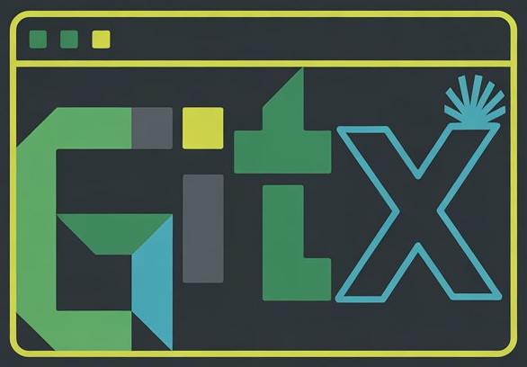

<div align="center">

# GITx - A Git TUI Helper



</div>

`gitx` is a Terminal User Interface (TUI) built with Go to help you learn and interact with Git. It provides a visual way to handle common Git commands, making it easier for both beginners and experienced users to manage their repositories without leaving the terminal.

Inspired by `lazygit`, `gitx` aims to provide a guided and educational experience.

## Features

* **Interactive UI:** A user-friendly terminal interface to visualize your Git workflow.
* **Common Git Actions:** Easily perform actions like staging, committing, stashing, and managing branches.
* **Educational:** Designed to help users understand what's happening under the hood, with clear labels and a straightforward layout.

## Installation

You can install `gitx` using the provided shell script. This requires `curl` and `tar` to be available on your system.

```bash
curl -sSL https://raw.githubusercontent.com/gitxtui/gitx/master/install.sh | bash
```

This will download the latest release and install it to `/usr/local/bin`.

## Usage

Simply run `gitx` from within a Git repository:

```bash
gitx
```

## Contributing

Contributions are welcome! Please read the [CONTRIBUTING.md](./CONTRIBUTING.md)

Join the discussion on our Discord server: <br> [](https://discord.gg/DphdFXd3Bh)

## Credits

This project is inspired by [lazygit](https://github.com/jesseduffield/lazygit), a powerful terminal UI for Git commands.

## License

This project is licensed under the MIT License - see the [LICENSE](./LICENSE) file for details.
